## Exercise 2 - Learn Publish-Subscribe pattern using S/4 HANA, AEM and Cloud Integration
In this exercise, we will learn an end-to-end publish-subscribe pattern using AEM and Cloud Integration. We will publish a Business Partner Change event from TryMe client to an AEM topic. The event will then be sent from the topic to two queues, which act as topic subscribers. Finally, two independent subscribers will receive the event by listening to their respective queues.

## Exercise 2.1 - Create new Queue in Advanced Event Mesh for second subscriber
After completing these steps you will have created a queue in Advanced Event Mesh.

1. Go back to the original tab in your browser of AEM and click on **"Cluster Manager"** on the left.
2. In the All Services screen click on the **"Broker Asia"** tile.

	**HINT:** If you cannot see the tiles, uncheck the "**Only show my services**" box.

	

3. Switch to **"Manage"** tab and click on the **"Queues"** button. A new browser tab/window will open.

   

4. Click the **"+ Queue"** button on the top right.

   
   
5. In the pop up enter the queue name: **User_XXX_WebApp** (replace **XXX** with your assigned user number) and click **"Create"**

    

6. On the next screen keep all the default settings and click **"Apply"**

	       

7. Find the queue in the list that you crated in the previous step and click on it. 

     
   
8. Switch to the **"Subscriptions"** tab and click on **"+ Subscription"**.

     

9. Enter following topic: **"s4/t41/400/ce/groupXX/BusinessPartner/Changed/v1"** (replace **XX** with your assigned user number). Click on **"Create"**.

	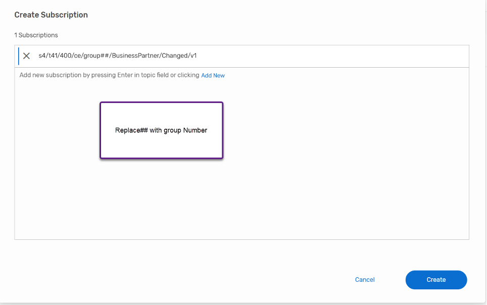

10. Simlarily subscribe to the same topic **"s4/t41/400/ce/groupXX/BusinessPartner/Changed/v1"** in the first queue **"User_XXX"** (replace **XXX** with your assigned user number) that you created in Exercise 1.2

	

<!-- ## Exercise 2.2 - Configure Publishing of S/4 HANA Business Partner Change event to AEM using RAP based events

1. Log into **WTS**

   Link: https://class.learning.sap.com/my.policy
   <br>System : **SY-S42023FPS2BGACC-WS001**
   <br>Username : **WS-XXX** where **XXX** is your assigned user number
   <br>Password: provided by the moderator
   
   **Note:** In case you get the error that **"Your session could not be established."**, open a new session

   
   <br><br>

3. After successfull login

   
   
4. Search for **SAP HANA Studio** and open the version **2.3.78**.

   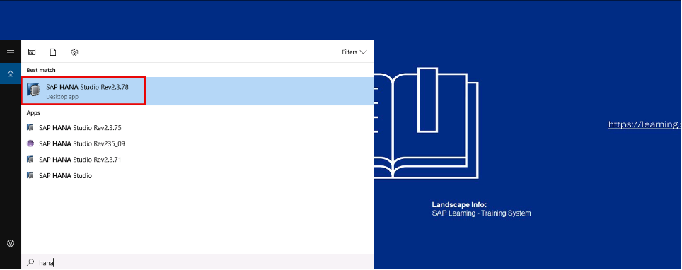

5. Verify if workspace name is **“AEMXX”** where **XX** is your assigned user number. Click on Launch.
   **Note:** In the screenshots, we are using 01 group as example.

   

   If the below pop-up appears, select **“Ask me later”**

   

6. To open the imported project, double click on the project on left side and enter the password: **Welcome1** and click on “OK”.

   

7. Expand **“Favorite Packages”**.

   

8. The package of RAP Objects imported (**Z_RAP_AEM_WORKSHOP**) can be seen. Expand it.

   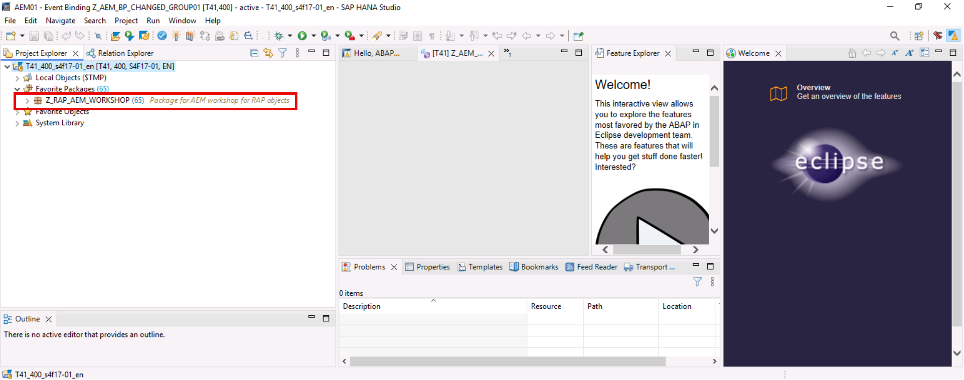

9. Expand **“Business Services”**.

   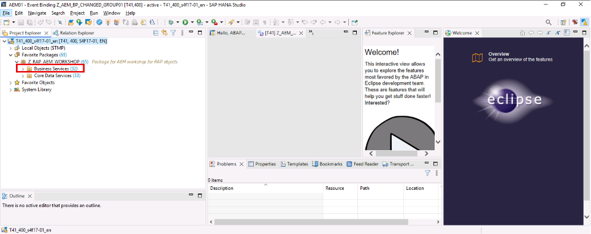

10. Expand **“Event Bindings”**.
    <br>**Note:** You can close the last two tabs for better view.

    

11. Double click on the event binding **Z_AEM_BP_CHANGED_GROUPXX** (where **XX** is your group number).
    <br>**Example is for Group/User 01** :

    

12. Click on **Save** and **Activate** the object.
    <br>Use the activation button  from the tool bar -->

## Exercise 2.2 - Configure First Subscriber using Cloud Integration capability of SAP Integration Suite
In this exercise, an Integration Flow is added as a subscriber via the Advanced Event Mesh adapter using the Solace Messaging Format (SMF). Integration flows can be used to mediate events, for example, to perform message transformation or protocol conversion steps.

### Exercise 2.2.1 - Setup REST Endpoint

Before we start building our integration flow, we will "provision" a simple HTTP endpoint where we will send the message.

1. **Webhook.site (HTTP endpoint)**

    For simplicity purposes, our REST consumer will be a simple HTTP endpoint that will receive the messages from the queue. We will use a tool called [Webhook.site](https://webhook.site/) to create a temporary endpoint that will receive the messages. When you navigate to the website, you will be presented with a unique URL that you can use to receive the messages. **Take note of the unique URL** as we will use it to configure the REST consumer.
    
    <p align = "center">
        <br/>
        <i>webhook.site example</i>
    </p>

### Exercise 2.2.2 - Create Integration Package in Cloud Integration capability of SAP Integration Suite

1. Open the SAP Integration Suite landing page via Integration suite link provided in [excel](https://sap-my.sharepoint.com/:x:/r/personal/kumar_amar_sap_com/Documents/Integration%20Suite%20Product%20Training%202025/SAP_IS_ProdTrain_2025_System_ForUsers.xlsx?d=w16fc76d40d70409e8aa46bba1311e28c&csf=1&web=1&e=lLzida)

   

2. Navigate to **Design > Integrations and APIs**, and select **Create**.

   
   
3. Fill the following:
   <br>**Name:** "User**XXX**" where **XXX** is your assigned user number
   <br>**Short Description:** "Integration Package for event mediation from User **XXX**".

   <br>click **Save**.

   

### Exercise 2.2.3 - Copy, Configure & Deploy the Integration Flow

1. Navigate to **Design > Integrations and APIs**.

2. Seach for the package "**Advanced Event Mesh Exercise - Solution**" and select it.

   

3. Navigate to the **"Artifacts"** tab select the **"Action"** button and click **"Copy"**

   

4. Change the name to **AEM_to_REST_EventMediation_UserXXX** and replace **XXX** with your assigned user number. Press the **"Select"** button to select the package.

   

5. Select the package you created in Exercise 2.2.

   

6. Press **"Copy"** button

   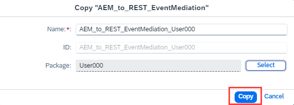

7. Press **Navigate** to go directly to the copied package.
<br>

8. Click on the copied integration flow to open it.
   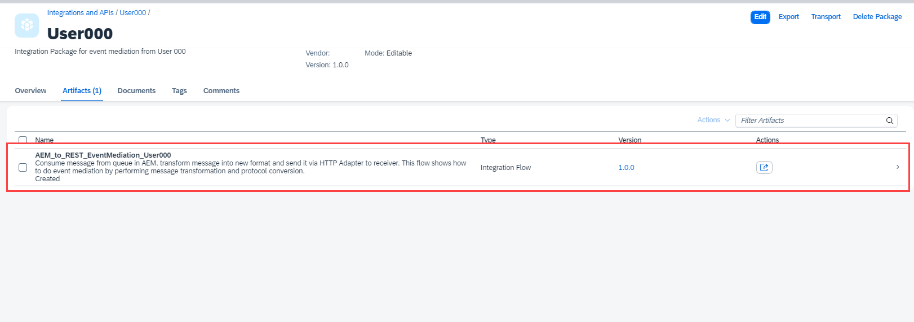

9. The integration flow will subscribe to your queue and performs a simple transformation from JSON to XML format. The result is sent to the HTTP reciever endpoint that you created in Exercise 2.1. Press **Configure** to set the required properties.

    

10. Provide the name of your AEM queue that you created in Exercise 1: **User_XXX** (replace **XXX** with your assigned user number).

    

11. Switch to the **"Receiver"** tab and provide your unique webhook URL you created in Exercise 2.1 and click on **"Save"** button.

    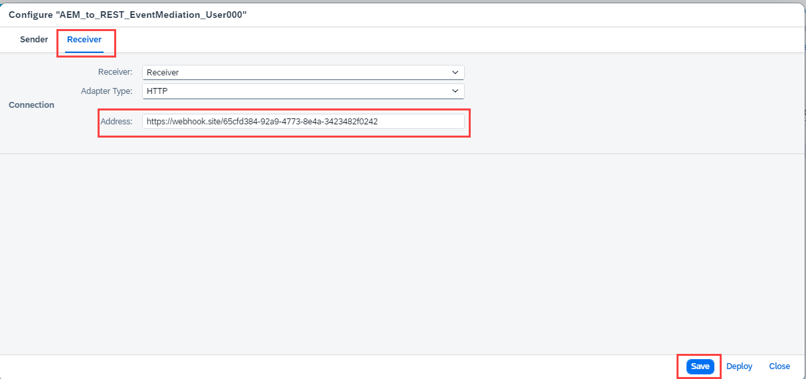

12. **Close** the warning message.

    

13. Press **"Deploy"** to deploy your integration flow.

    

14. Select Runtime Profile **"Cloud Integration"** and press **"Yes"**. Press **"Ok**" to close the dialog.

    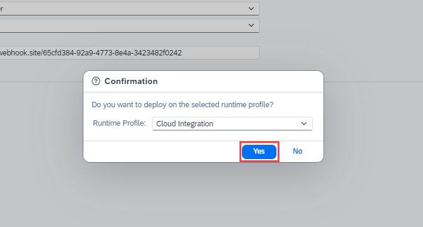


## Exercise 2.3: Configure Standalone Web Application as Second Subscriber
In this exercise you will configure the Business Partner Web Application. On this Website you will subscribe to the queue created in Exercise 2.1 via your web browser. Every business partner change published to your queue will be shown on the web application in real-time.

1. Open the [Business Partner Web Applicaiton](https://sap-cpisuite-europe-01n-cpisuite-europe-01-aem-demo-client.cfapps.eu10.hana.ondemand.com/app/index.html#/businessPartner).
2. Provide the same connection details as captured in [Exercise 1.4 - Send an event from the Try Me! Tool to your Topic](../ex1#exercise-14---send-an-event-from-the-try-me-tool-to-your-topic)
3. Change Subscription Type to **"Queue"** and fill in the queue name created in Exercise 2.1: **User_XXX_WebApp** (replace **XXX** with your assigned user number). Press **"Connect"**.

	> **_HINT:_** If your broswer is asking to use a certificate for authentication, press "Do not send certificate".

	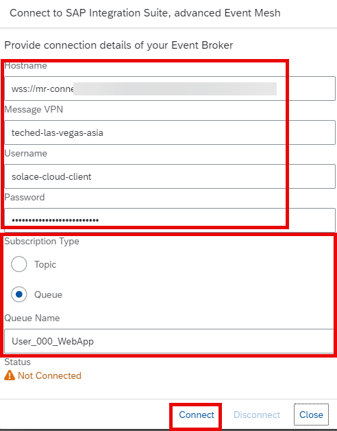

4. The Pop-Up should close and status shows **"Connected"**. Now your browser is directly subscribed to the queue and ready to receive business partner events.

   

<!-- ## Exercise 2.5: Run the scenario by publishing the RAP-based S/4 HANA Business Partner Change event, which involves modifying an existing business partner
In this exercise we will publish a Business Partner Change event in S/4Hana that will trigger both the subscribers automatically.

1. **Access T41** : Open SAP GUI from WTS
   <br>Link: https://class.learning.sap.com/my.policy
   <br>System : **SY-S42023FPS2BGACC-WS001**
   <br>Username : **WS-XXX** where **XXX** is your assigned user number
   <br>Password: provided by the moderator
   
   **Note:** In case you get the error that **"Your session could not be established."**, open a new session

   
   <br><br>

2. Open SAP Logon and click on T41

      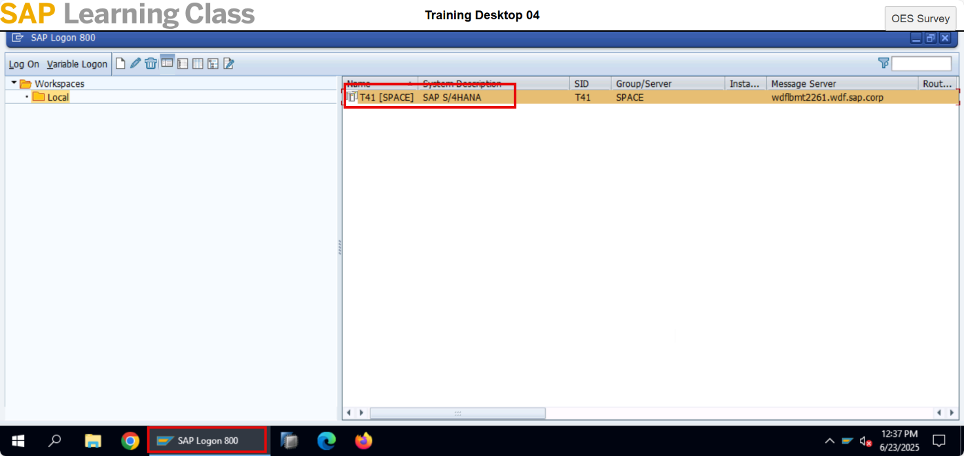

3. Give User: **S4F17-XX** where **XX** is the assigned user number. Example -> S4F17-01
   <br>Password: **Welcome1**

   Click **"Enter"**

   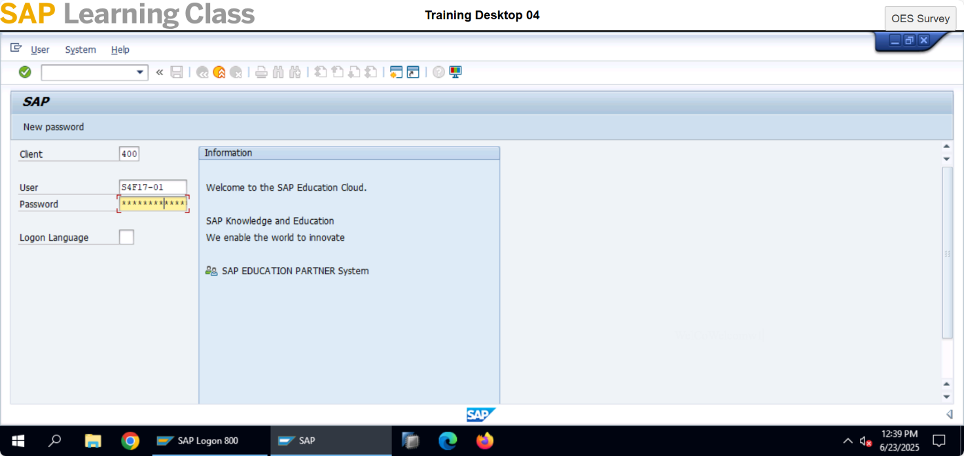

4. Accept the system messages

   

5. Training Desktop will be open as given below:

   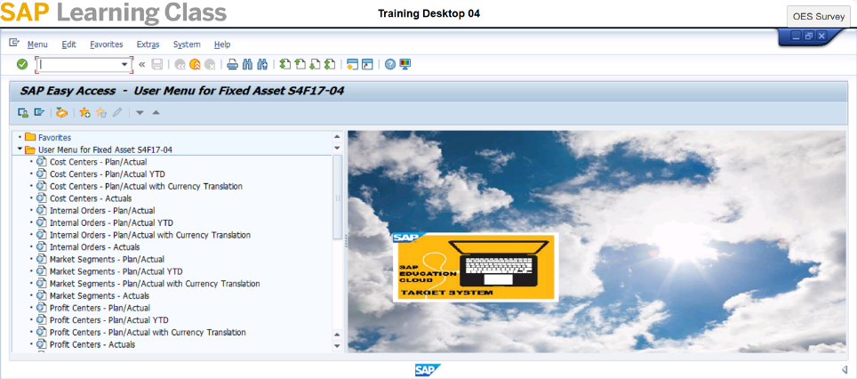

6. Enter Tcode: /nbp and click on enter button.

   

7. Enter Business Partner number **S610-AXX** where **XX** is your assigned user number
   Click on "Start"

   

8. Choose the Business Partner by double clicking.

   **Note: In the screenshots, we are using 01 group as an example**

   

9. Click on **Change** button as highlighted below.

   

10. Change details of the Business Partner such as name.

    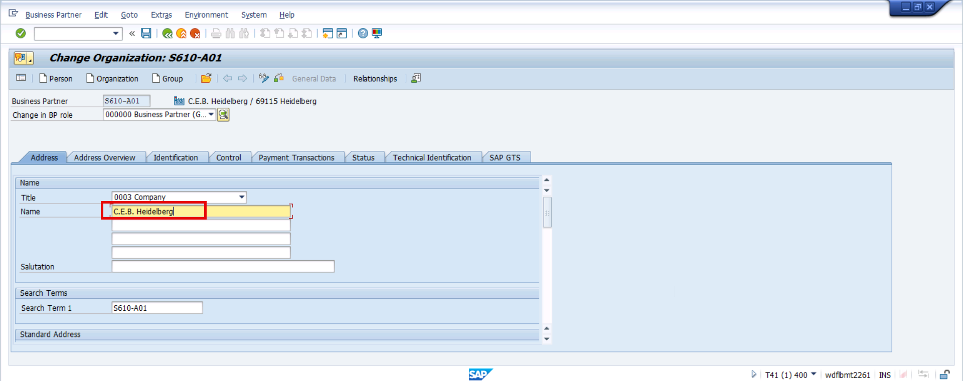

11. Click on **"Save"**

    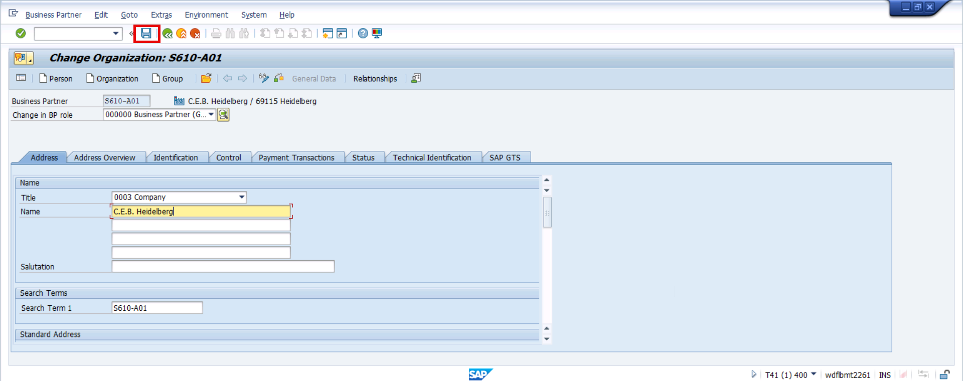

12. Enter **/n/IWXBE/EVENT_MONITOR** t-code to view the monitoring.

    

13. Click on **AEM_BASIC_RAP**

    

14. Click on outbound events. Check the event triggered for your group number by the topic name:

    **s4/t41/400/ce/groupXX/BusinessPartner/Changed/v1** where **XX** is your assigned user number

    **In our example for group01 - "s4/t41/400/ce/group01/BusinessPartner/Changed/v1"**

    

15. You can see all messages including the payloads

    

### Exercise 2.5.1. Monitor Consumed Messages
As S/4 Hana system published an event to a topic, all queues subscribed to that topic have received the event. This means the integration flow configured in Exercise 2.3 is executed and also the standalone web application should have received the event.

1. Navigate to "**Monitor-> Integrations and APIs**". Open the **"Manage Integration Content"** tile.

    

2. Search for your integration flow. It should be in **"Started"** status. Press **"Monitor Message Processing"** to view the processed Messages.

    

3. You should see at least one Messages in the list with Status **"Completed"**.

   

4. Open the webhook site created in Exercise 2.1. Here you should the messages sent from Cloud Integration. Notice the format and structure was slightly changed by the integrtation flow mapping.

   

5. You should also see your entry in the standalone web application. Be aware that if you send a business partner with the same ID, an update of the existing entry will be triggered instead of creating a new entry.

    -->

## Exercise 2.4: Publish a business partner event using the try me! tool to the topic
1. Navigate to the Try Me! tool in advanced event mesh
2. Under the publish section choose topic and provide the topic `s4/t41/400/ce/groupXX/BusinessPartner/Changed/v1`, replace XX with your user number
3. Use the below provided json as the message content,
   ```json
	{
		"specversion": "1.0",
		"type": "group30.BusinessPartner.Changed.v1",
		"source": "/default/sap.s4.custom/HE4CLNT400",
		"datacontenttype": "application/json",
		"id": "iopoR}Qa7k{IeB7xyLljsm",
		"time": "2024-07-23T15:09:31Z",
		"data": {
			"BusinessPartner": "A10",
			"LastName": "John",
			"FirstName": "Doe",
			"Country": "DE",
			"City": "Walldorf",
			"PostCode": "69190",
			"Street": "Dietmar-Hopp-Allee",
			"HouseNumber": "16"
		}
	}
	
	```

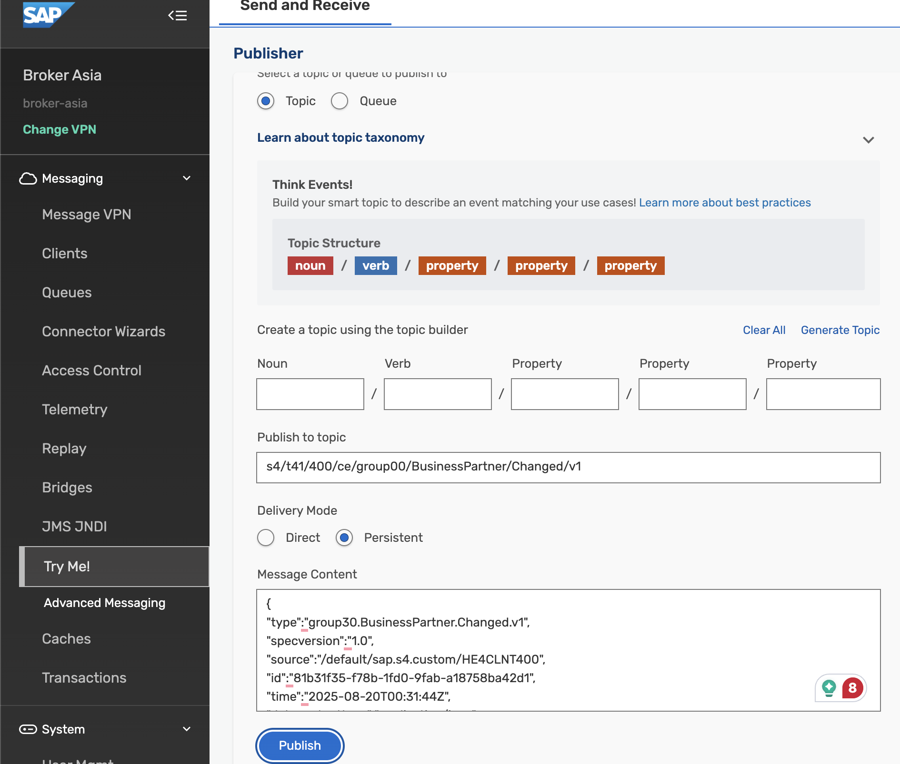

### Exercise 2.4.1. Monitor Consumed Messages
As S/4 Hana system published an event to a topic, all queues subscribed to that topic have received the event. This means the integration flow configured in Exercise 2.3 is executed and also the standalone web application should have received the event.

1. Navigate to "**Monitor-> Integrations and APIs**". Open the **"Manage Integration Content"** tile.

    

2. Search for your integration flow. It should be in **"Started"** status. Press **"Monitor Message Processing"** to view the processed Messages.

    

3. You should see at least one Messages in the list with Status **"Completed"**.

   

4. Open the webhook site created in Exercise 2.1. Here you should the messages sent from Cloud Integration. Notice the format and structure was slightly changed by the integrtation flow mapping.

   

5. You should also see your entry in the standalone web application. Be aware that if you send a business partner with the same ID, an update of the existing entry will be triggered instead of creating a new entry.

   

   
**Congratulations, you have completed all the exercises!**
