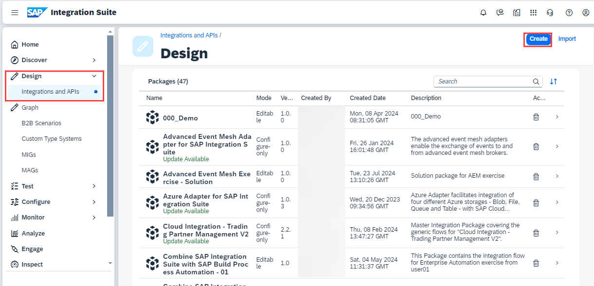
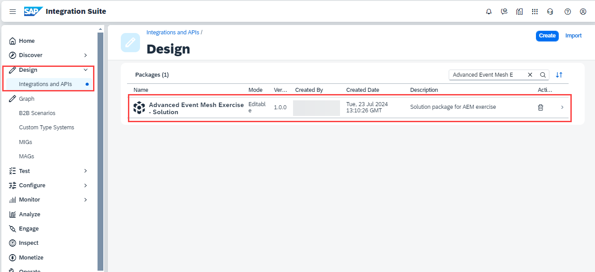
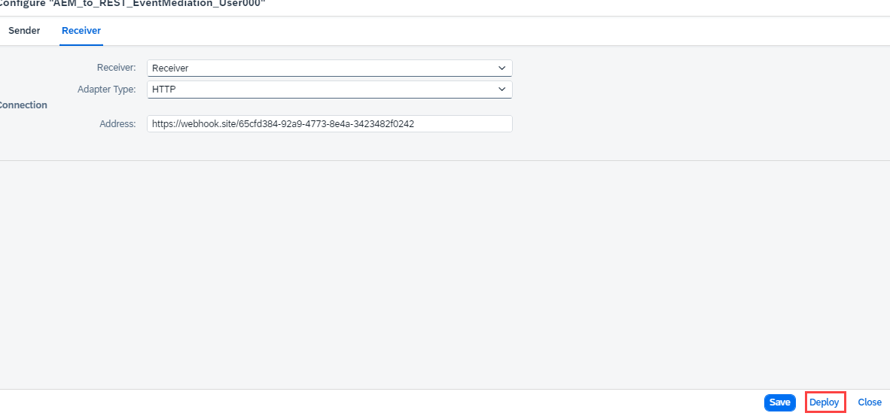
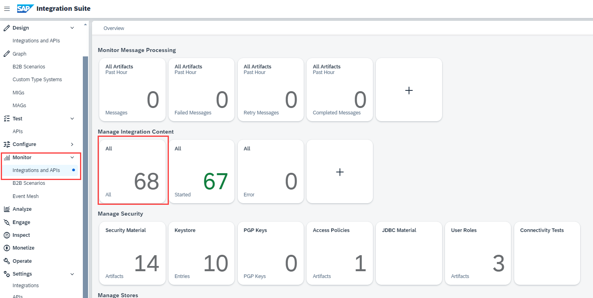
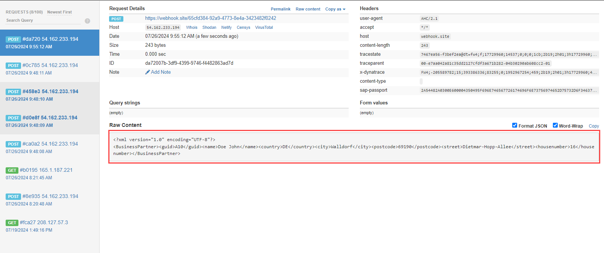

## Exercise 2 Use Cloud Integration capablity for event mediation
In this exercise, an Integration Flow is added as a consumer via the Advanced Event Mesh adapter using the Solace Messaging Format (SMF). Integration flows can be used to mediate events, for example, to perform message transformation or protocol conversion steps.

## 2.1 Setup REST Endpoint

Before we start building our integration flow, we will "provision" a simple HTTP endpoint where we will send the message.

### webhook.site (HTTP endpoint)

For simplicity purposes, our REST consumer will be a simple HTTP endpoint that will receive the messages from the queue. We will use a tool called [Webhook.site](https://webhook.site/) to create a temporary endpoint that will receive the messages. When you navigate to the website, you will be presented with a unique URL that you can use to receive the messages. **Take note of the unique URL** as we will use it to configure the REST consumer.

     
    <i>webhook.site example</i>

## 2.2 Create Integration Package

1. Open the to the SAP Integration Suite landing page via this [link](https://cpisuite-europe-03.integrationsuite.cfapps.eu20-001.hana.ondemand.com/shell/home).
   

2. Navigate to  <b>Design > Integrations</b>, and select  <b>Create</b>.
   
   
3. Fill in following **Name:** User**XXX** where <b>XXX</b> is your user number and a short <b>description</b> eg. "Integration Package for event mediation User **XXX**". Then click <b>Save</b>.
   

## 2.3 Copy & Configure Integration Flow

4. Navigate to  <b>Design > Integrations</b>.

5. Seach for the package "Advanced Event Mesh Exercise - Solution" and select it.
   

6. Navigate to tab **"Artifacts"** select the **"Action"-button** and press **"Copy"**
 

7. Change the name to AEM_to_REST_EventMediation_User**XXX** and replace **XXX** with your user id. Press the **"Select"** button to select the package.
 

8. Select the package you created in exercise 2.2.
 

9. Press **"Copy"**.
 

10. Press **Navigate** to go directly to the copied package.
 

11. Click on your integration flow to open it.
 

12. The flow will subscribe to your queue and performs a simple transformation from JSON to XML format. The result is sent to the HTTP reciever you created in exercise 2.1. Press **Configure** to set the required properties.
 

13. Provide the name of your queue created in exercise 1: User_**XXX** (replace **XXX** with your user number).
 

14. Switch to tab **"Receiver"** and provide your unique webhook URL you created in exercise 2.1. Press **"Save"**
 

15. **Close** the warning message.
 

16. Press **"Deploy"** to deploy your integration flow.
 

17. Select Runtime Profile **"Cloud Integration"** and press **"Yes"**. Press **"Ok**" to close the dialog.
 

## 2.4. Monitor Messages
18. Navigate to "**Monitor-> Integrations and API**". Open the **"Manage Integration Content"** tile.
 

19. Search for your integration flow. It should be in **"Started"** status. Press **"Monitor Message Processing"** to view the processed Messages.
 

20. You should see at least one Messages in the list with Status **"Completed"**.
 

21. Open the webhook site created in exercise 2.1. Here you should the messages sent from Cloud Integration. Notice the format and structure was slightly changed by the integrtation flow mapping.
 

Please continue with [Exercise 3](../ex3/README.md)
