## Exercise 3: Incremental growth: Add web application as additional consumer

The publish-subscribe pattern decouples the sending and receiving applications. This makes it easy to add new applications allows for incremental growth. In this exercise a web application is added as additional consumer. The web application is subscribed to a queue and lists all business partners.

## Exercise 3.1: Create new queue for RAP based events

1. Go back to the original tab in your browser of AEM and click on **"Cluster Manager"** on the left.
2. In the All Services screen click on the **"Broker Asia"** tile.

> **_HINT:_** If you cannot see the tiles, uncheck the "Only show my services" box.

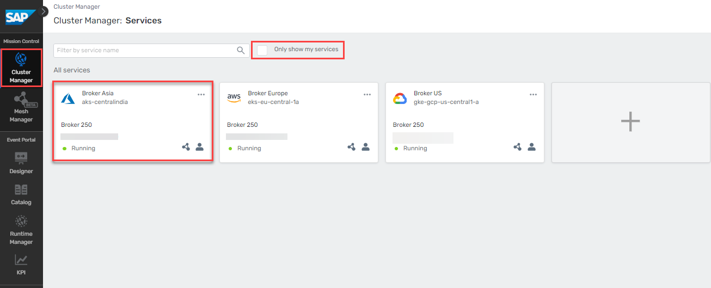

3. Switch to **"Manage"** tab and click on the **"Queues""** tile. A new window opens up.

4. Click on Queue to create new queue

   
5. Give the Name in the Format
   RAP*AEM*## (where ## is Your Group Number)

   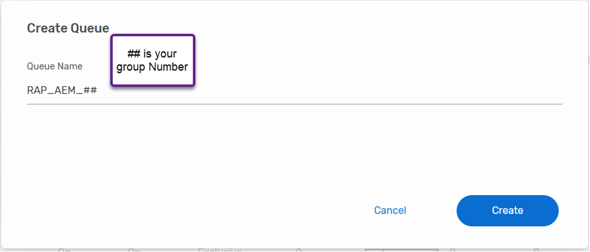
6. Click on "Create" ->Then click on "Apply"

   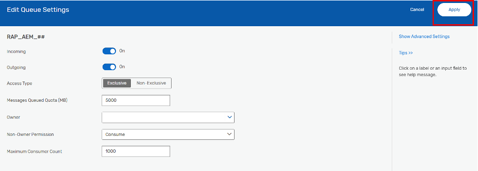
7. Click on the Queue that is created - Select the Subscription Tab

   
8. Enter the Topic name with the below format(Replace ## with Group name)
   s4/t41/400/ce/group##/BusinessPartner/Changed/v1

   
9. Click on "Create"

## Exercise 3.2: RAP based events

1. ###### Details of WTS landscape and login to T41

   1. ** WTS/Terminal access**
      URL : https://class.learning.sap.com/my.policy
      system : ** SY-S42023FPS2BGACC-WS001**
      user : WS-001 till WS-030
      password: Shared by Moderator\*
   2. T41 System Login Information for SAPGUI

      System : T41
      Client : 400
      User. : S4F17-01till S4F17-30
      Password : Welcome1
2. ###### Set up RAP based events :

   1. **Access WTS** - Open the URL( from 1.1 above) for the WTS / Terminal access
      In case you get following screen: take attention to the section marked in red

      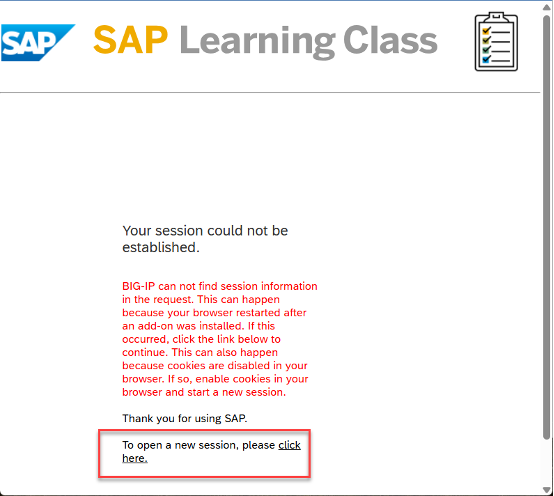
   2. When you get to the logon screen, please fill the required data (from 1.1 above)

      

      Example for Group 01: It Should be **WS-001**

      system:   SY-S42023FPS2BGACC-WS001
      User:  \*\*WS-0##
      Password: SIXTrainingWS25!
   3. After successfull login

      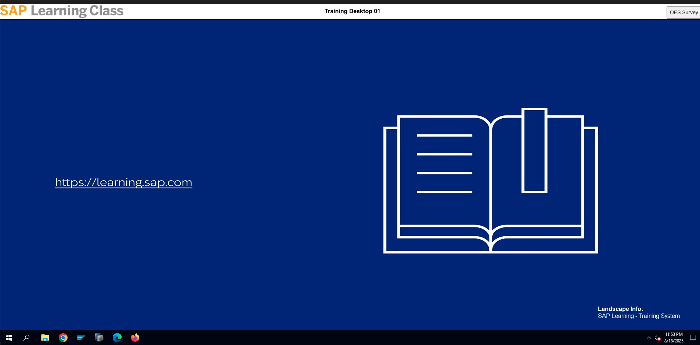
   4. Search for SAP HANA studio and open the version 2.3.78.

      
   5. Verify if workspace name is “AEM##” where ## is your group number. Click on Launch.
      **Note: ** **In the screenshots, we are using 01 group as example.**

      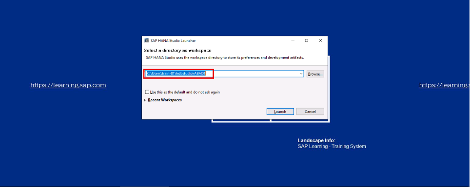

      If the below pop-up appears, select “Ask me later”

      
   6. To open the imported project, double click on the project on left side and enter the password: Welcome1 and click on “OK”.

      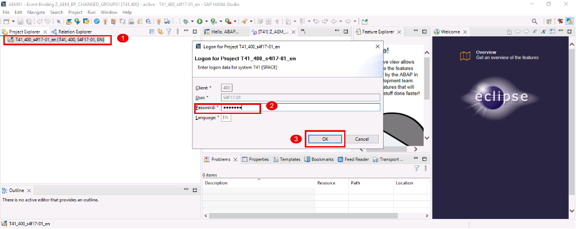
   7. Expand “Favorite Packages”.

      
   8. The package of RAP Objects imported (Z_RAP_AEM_WORKSHOP) can be seen. Expand it.

      
   9. Expand “Business Services”.

      
   10. Expand “Event Bindings”.  
       Note: You can close the last two tabs for better view.

   

   11. Double click on the event binding Z_AEM_BP_CHANGED_GROUP## (where ## is your group number).

   **Example is from group01** :

   

   12. Click on Save and Activate the object.
       Use the activation button  from the tool bar
3. ###### **Trigger the RAP event by changing an existing partner**

   1. **Access T41** : Open SAP GUI from WTS link for WTS: https://class.learning.sap.com/my.policy
      Enter the below details
      system:     SY-S42023FPS2BGACC-WS001
      user:       WS-001  till WS-030
      password:   SIXTrainingWS25!

      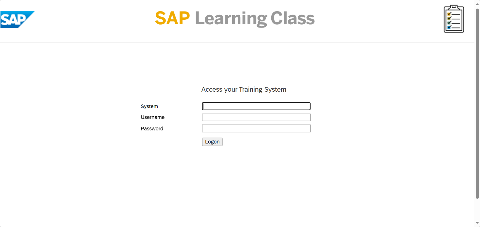
   2. Open SAP Logon and click on T41

      
   3. Give user: S4F17-##   (##-- group number)  Example ->S4F17-01

      password : Welcome1

      Click "Enter"

      
   4. Accept the system messages
      
   5. Training Desktop will be open as below

      
   6. Enter Tcode: /nbp and click on enter button.

      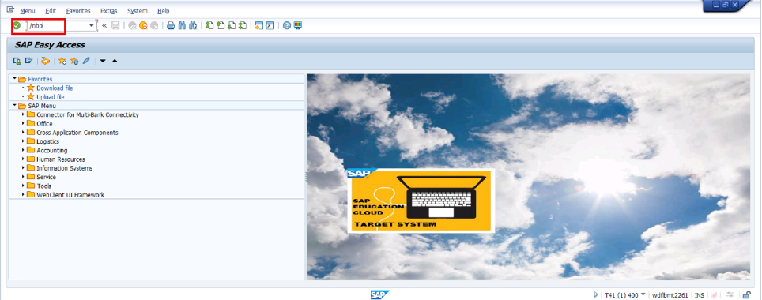
   7. Enter Business Partner number S610-A##((where ## is your group number)
      Click on "Start"

      
   8. Choose the Business Partner bydouble clicking.

      **Note: In the screenshots, weare using 01 group for example**

      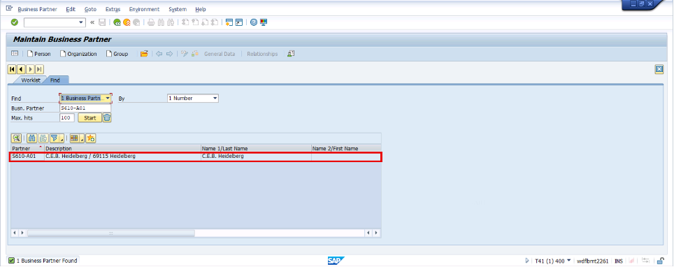
   9. Click on Change button as highlighted below.

      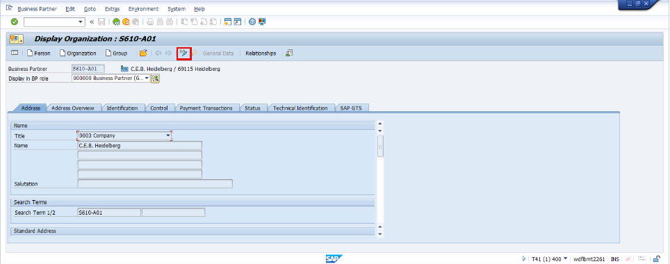
   10. Change details from the business partner such as name.

       
   11. Click on "Save"

       
   12. Enter /n/IWXBE/EVENT_MONITOR t-code to view the monitoring.

       
   13. Click on AEM_BASIC_RAP

       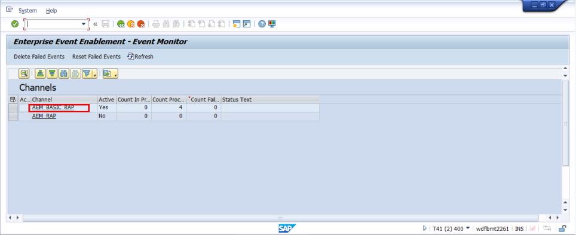
   14. Click on outbound events. Check the event triggered for your group number by the topic name:

       **s4/t41/400/ce/group##/BusinessPartner/Changed/v1  ( ## your group number ) **

       **In our example for group01**

       **s4/t41/400/ce/group01/BusinessPartner/Changed/v1**

       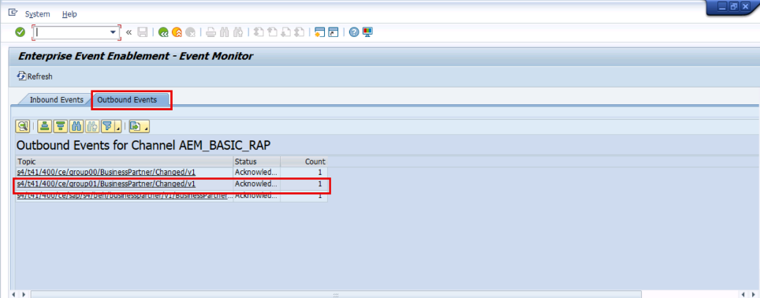
   15. You can see all messages including the payloads

       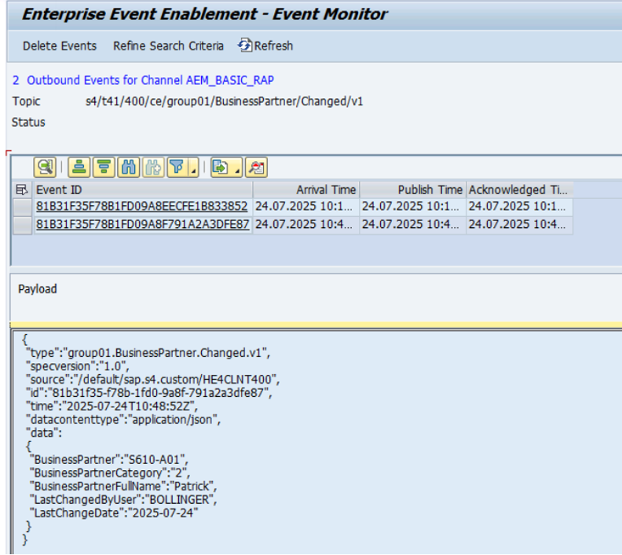
4. ###### Check the event which has reached Advanced Event Mesh

   1. Go back to tab in your browser of AEM and click on **"Cluster Manager"** on the left.

      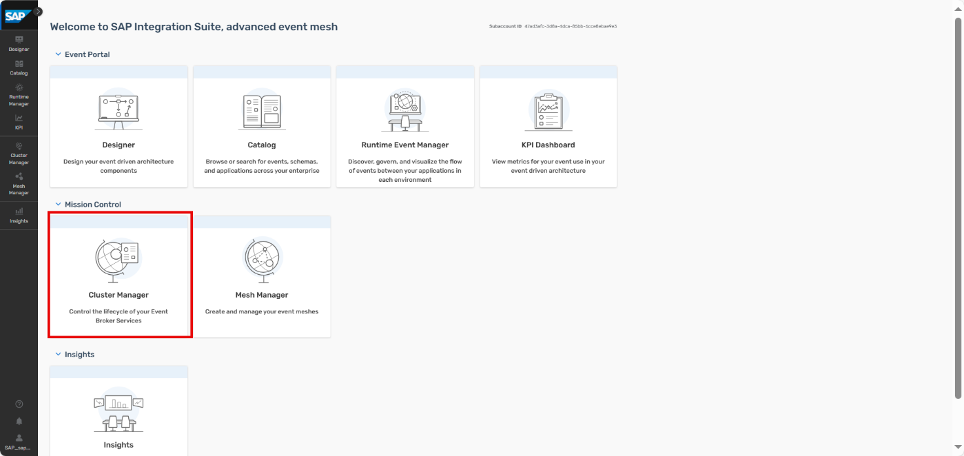
   2. Click on "Broker Asia" broker - in which we created queue and topic subscriptions.
      Click on manage and go to queues.

      Select the queue RAP*AEM*## (where ## is your group number)

      
   3. Click on Messages Queued to view the message in AEM

      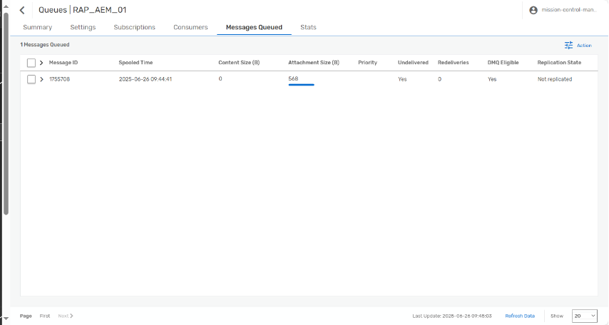

## Exercise 3.3: Configure Web Application

In this exercise you will conifugre the Business Partner Web Application. On this Website you will subscribe to the queue creatd in exercise 3.1 via your web browser. Every business partner published to your queue will be shown on the website.

1. Open the [Business Partner Web Applicaiton](https://sap-cpisuite-europe-01n-cpisuite-europe-01-aem-demo-client.cfapps.eu10.hana.ondemand.com/app/index.html#/businessPartner).
2. Provide the same connection details as captured in [Exercise 1.4 - Send an event from the Try Me! Tool to your Topic](../ex1#exercise-14---send-an-event-from-the-try-me-tool-to-your-topic)
3. Change Subscription Type to **"Queue"** an fill in the queue name created in exercise 3.1: **User_XXX_WebApp** (replace **XXX** with your user number). Press **"Connect"**.

> **_HINT:_** If your broswer is asking to use a certificate for authentication, press "Do not send certificate".

5. The Pop-Up should close and status shows **"Connected"**. Now your browser is directly subscribed to the queue and ready to receive business partner events.
   

## Exercise 3.4: Publish RAP based event again

1. To publish an S4 RAP based events - Repeat Excercise 3.2.3 Steps 1 - 10
2. You should see your entry in the application. Be aware that if you send a business partner with the same ID, an update of the existing entry will be triggered instead of creating a new entry.
   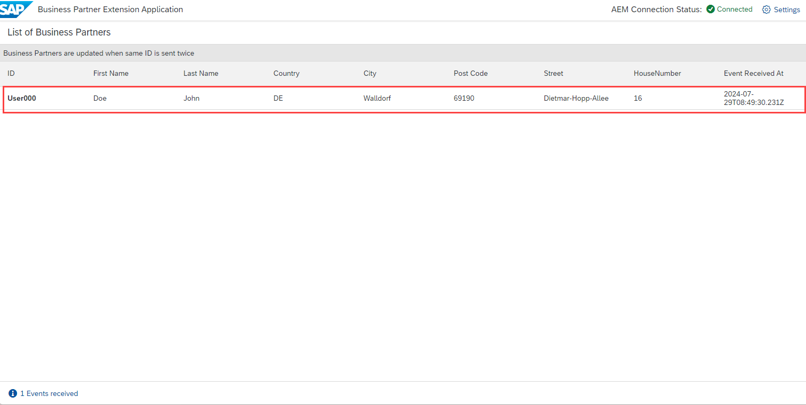
3. As system published the event to a topic, all queues subscribed have received the event. This means also the integration flow in exercise 2 is executed again and you should see an corresponding entry in the webhook site.

**Congratulations, you completed all exercises!**
